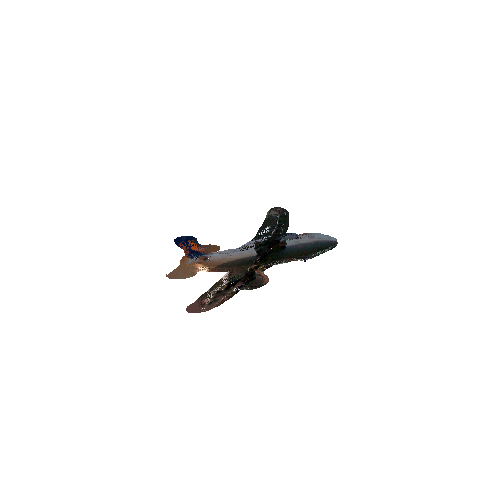
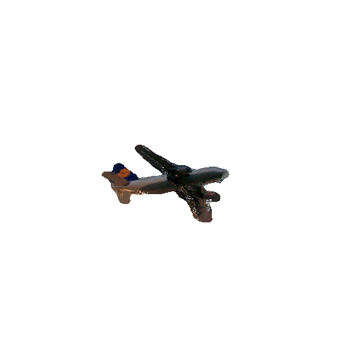
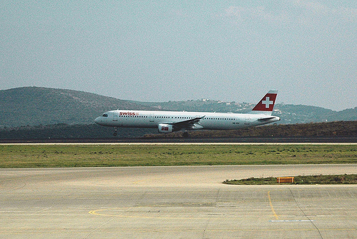
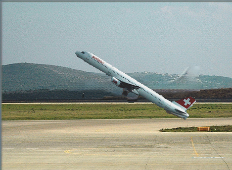

This repo renders 3D rotation on mesh and inpaints colors on missing pixels after rotation. Additional, it supports 2D in-plane rotation. 

3D rotation example:  
  
After rotation, inpainting, and rendering: 

   
Other angles are available in output directory.
   

2D rotation example:   
 

rotation after 30 degrees upward: 

