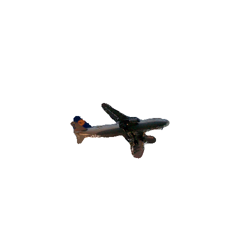

This repo renders 3D rotation on mesh and inpaints colors on missing pixels after rotation. Additional, it supports 2D in-plane rotation. 

1. 3D rotation example:
original image: 
After rotation, inpainting, and rendering:

Other angles are available in output directory.

2. 2D rotation example:
original image: 

rotation after 30 degrees upward:
